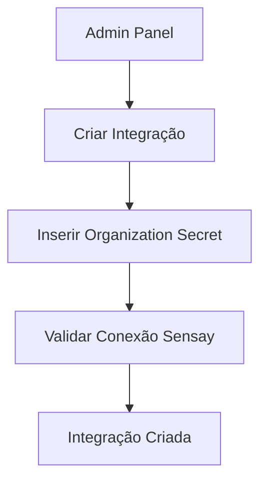
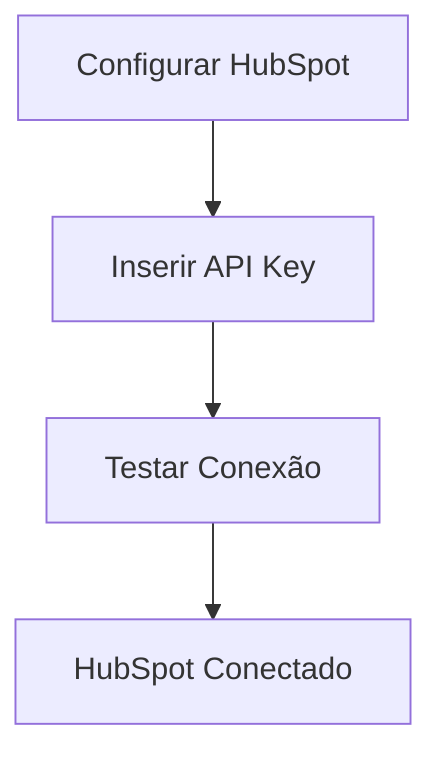
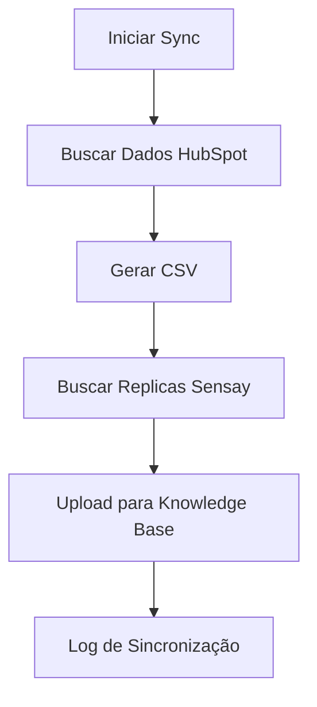

# Sensay Real Estate AI Agent

Uma plataforma de integração que conecta sistemas de CRM (HubSpot) com agentes de IA da Sensay para automatizar o atendimento imobiliário.

## 🏗️ Arquitetura

### Visão Geral
A aplicação segue uma arquitetura simplificada que utiliza a API da Sensay como backend principal, mantendo apenas configurações locais necessárias.

```
┌─────────────────┐    ┌─────────────────┐    ┌─────────────────┐
│   Admin Panel   │    │   Backend API   │    │  Sensay API     │
│   (React/Vite)  │◄──►│   (Fastify)     │◄──►│  (External)     │
└─────────────────┘    └─────────────────┘    └─────────────────┘
         │                       │                       │
         │                       │                       │
         ▼                       ▼                       ▼
┌─────────────────┐    ┌─────────────────┐    ┌─────────────────┐
│   Frontend UI   │    │   Local DB      │    │ Organizations   │
│   - Settings    │    │   (SQLite)      │    │ - Users         │
│   - Dashboard   │    │   - Integrations│    │ - Replicas      │
│   - HubSpot     │    │   - HubSpot     │    │ - Knowledge     │
└─────────────────┘    │   - Sync Logs   │    │   Base          │
                       └─────────────────┘    └─────────────────┘
```

### Hierarquia Sensay
```
Organizations (X-ORGANIZATION-SECRET)
    ├── Users (X-USER-ID)
    │   └── Replicas (AI Agents)
    │       └── Knowledge Base (Training Data)
    └── Settings & Configurations
```

## 🚀 Tecnologias

### Backend
- **Fastify** - Framework web rápido
- **TypeScript** - Tipagem estática
- **Prisma** - ORM para banco de dados
- **SQLite** - Banco de dados local
- **Axios** - Cliente HTTP para Sensay API

### Frontend
- **React** - Interface de usuário
- **Vite** - Build tool
- **CSS Modules** - Estilização

### Integrações
- **Sensay API** - Gerenciamento de agentes IA
- **HubSpot API** - CRM de imóveis

## 📁 Estrutura do Projeto

```
sensay/
├── backend/                 # API Backend
│   ├── src/
│   │   ├── controllers/     # Controladores
│   │   │   └── sensayController.ts
│   │   ├── routes/          # Rotas da API
│   │   │   ├── index.ts
│   │   │   ├── sensayRoutes.ts
│   │   │   └── authRoutes.ts
│   │   ├── services/        # Serviços
│   │   │   ├── sensayApiService.ts
│   │   │   └── hubspotDataSimulator.ts
│   │   ├── middlewares/     # Middlewares
│   │   ├── utils/           # Utilitários
│   │   └── config/          # Configurações
│   ├── prisma/              # Schema do banco
│   │   └── schema.prisma
│   └── uploads/             # Arquivos CSV gerados
├── admin/                   # Painel Administrativo
│   ├── src/
│   │   ├── components/      # Componentes React
│   │   │   ├── Settings/
│   │   │   ├── Dashboard/
│   │   │   └── Header/
│   │   └── App.jsx
│   └── public/
└── frontend/                # Frontend Principal
    ├── pages/
    └── components/
```

## 🗄️ Schema do Banco de Dados

### Modelos Principais

```prisma
model IntegrationSettings {
  id                String   @id @default(uuid())
  organizationSecret String  @unique  // X-ORGANIZATION-SECRET da Sensay
  organizationName  String
  settings          String?  // JSON com configurações locais
  createdAt         DateTime @default(now())
  updatedAt         DateTime @updatedAt

  hubspotSettings   HubSpotSettings?
  syncLogs          SyncLog[]
}

model HubSpotSettings {
  id             String   @id @default(uuid())
  integrationId  String   @unique
  apiKey         String
  isConnected    Boolean  @default(false)
  lastSync       DateTime?
  propertiesCount Int     @default(0)
  syncStatus     String   @default("idle")
  errorMessage   String?
  createdAt      DateTime @default(now())
  updatedAt      DateTime @updatedAt

  integration    IntegrationSettings @relation(fields: [integrationId], references: [id])
}

model SyncLog {
  id             String   @id @default(uuid())
  integrationId  String
  replicaId      String?  // ID da replica na Sensay
  operation      String   // sync, upload, create_user, etc.
  status         String   // success, error, pending
  details        String?  // JSON com detalhes da operação
  errorMessage   String?
  createdAt      DateTime @default(now())

  integration    IntegrationSettings @relation(fields: [integrationId], references: [id])
}
```

## 🔧 Configuração

### 1. Backend

```bash
cd backend
npm install
npx prisma migrate dev
npm run dev
```

### 2. Admin Panel

```bash
cd admin
npm install
npm run dev
```

### 3. Variáveis de Ambiente

```env
# Backend (.env)
DATABASE_URL="file:./dev.db"
PORT=3000
HOST=0.0.0.0

# Sensay API
SENSAY_BASE_URL="https://api.sensay.io/v1"
SENSAY_ORGANIZATION_SECRET="your-organization-secret"
SENSAY_API_VERSION="2025-03-25"

# HubSpot
DEFAULT_HUBSPOT_API_KEY="your-hubspot-api-key"
```

## 📡 API Endpoints

### Integrações
- `GET /api/v1/integrations` - Listar integrações
- `POST /api/v1/integrations` - Criar integração

### HubSpot
- `POST /api/v1/integrations/:id/hubspot/connect` - Conectar HubSpot
- `POST /api/v1/integrations/:id/hubspot/sync` - Sincronizar dados
- `GET /api/v1/integrations/:id/hubspot/status` - Status da conexão

### Sensay (via API)
- `POST /api/v1/integrations/:id/users` - Criar usuário
- `GET /api/v1/integrations/:id/users` - Listar usuários
- `POST /api/v1/integrations/:id/replicas` - Criar replica
- `GET /api/v1/integrations/:id/replicas` - Listar replicas

### Logs
- `GET /api/v1/integrations/:id/logs` - Logs de sincronização

## 🔄 Fluxo de Trabalho

### 1. Configuração Inicial


### 2. Integração HubSpot


### 3. Sincronização de Dados


## 🎯 Funcionalidades

### ✅ Implementadas
- [x] Criação de integrações com Sensay
- [x] Configuração de HubSpot por integração
- [x] Sincronização automática de dados
- [x] Geração de CSV genérico
- [x] Upload para knowledge base da Sensay
- [x] Logs de operações
- [x] Interface administrativa

### 🔄 Em Desenvolvimento
- [ ] Autenticação de usuários
- [ ] Dashboard de métricas
- [ ] Agendamento de sincronizações
- [ ] Múltiplas integrações simultâneas

## 🚀 Como Usar

### 1. Acessar Admin Panel
```
http://localhost:5173
```

### 2. Criar Integração
1. Inserir nome da organização
2. Inserir `X-ORGANIZATION-SECRET` da Sensay
3. Clicar em "Create Integration"

### 3. Configurar HubSpot
1. Inserir API Key do HubSpot
2. Clicar em "Connect HubSpot"

### 4. Sincronizar Dados
1. Clicar em "Sync Now"
2. Aguardar processamento
3. Verificar logs de sincronização

## 🔍 Monitoramento

### Logs de Sincronização
```json
{
  "id": "uuid",
  "integrationId": "uuid",
  "replicaId": "sensay-replica-id",
  "operation": "hubspot_sync",
  "status": "success",
  "details": {
    "propertiesCount": 25,
    "replicasUpdated": 3,
    "uploadResults": [...]
  },
  "createdAt": "2025-01-15T18:30:00Z"
}
```

### Status da API
```bash
curl http://localhost:3000/api/v1/integrations
```

## 🛠️ Desenvolvimento

### Comandos Úteis
```bash
# Backend
npm run dev          # Desenvolvimento
npm run build        # Build
npx prisma studio    # Interface do banco
npx prisma migrate   # Migrações

# Admin
npm run dev          # Desenvolvimento
npm run build        # Build
```

### Estrutura de Dados CSV
O sistema gera CSVs genéricos que se adaptam a diferentes estruturas de dados:

```csv
title,price,location,bedrooms,bathrooms,area,type,status
Apartamento Jardim Botânico,750000,Rua das Flores 123,3,2,120,sale,available
Casa Residencial,450000,Av. Principal 456,4,3,180,sale,available
```

## 📝 Notas Técnicas

### Sensay API Integration
- Utiliza `X-ORGANIZATION-SECRET` para autenticação
- Suporte completo para usuários, replicas e knowledge base
- Upload de dados via endpoint `/replicas/{id}/knowledge-base`

### HubSpot Simulation
- Simula busca de dados do HubSpot
- Gera dados mockados para demonstração
- CSV genérico compatível com diferentes estruturas

### Banco de Dados Local
- Armazena apenas configurações e logs
- Dados principais ficam na Sensay
- Schema simplificado e otimizado

## 🤝 Contribuição

1. Fork o projeto
2. Crie uma branch para sua feature
3. Commit suas mudanças
4. Push para a branch
5. Abra um Pull Request

## 📄 Licença

Este projeto está sob a licença MIT. Veja o arquivo `LICENSE` para mais detalhes.

---

**Desenvolvido para o hackathon Sensay** 🚀